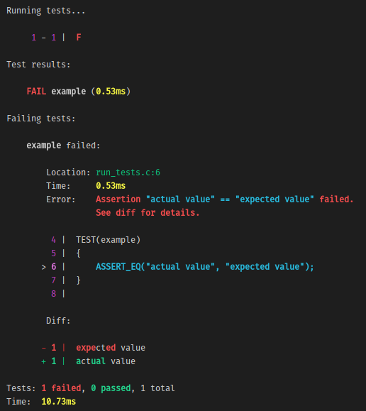

# Basic example

This is the most basic usage of Narwhal possible. To run this example, Narwhal should be installed globally. Check out the [`run_tests.c`](https://github.com/vberlier/narwhal/blob/master/examples/basic/run_tests.c) file for a very simple introduction to Narwhal.

You can compile this example by running `make`.

```bash
$ make
```

Then, run the example with the generated executable.

```bash
$ ./run_tests
```

The test is adding `2` and `3` together instead of multiplying them. This causes the assertion to be false, so running the executable will report that the test fails.


